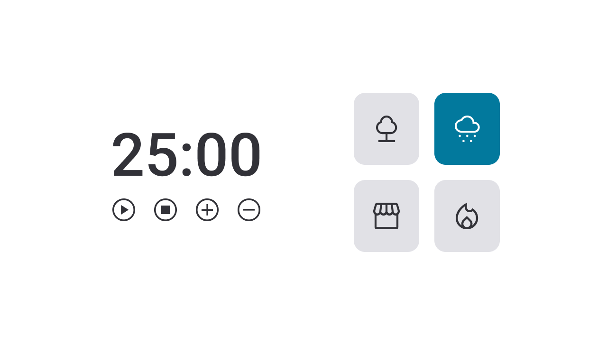

<h1 align="center"> Focus Timer 2.0</h1>

O Focus Timer 2.0 é uma versão aprimorada do Timer desenvolvido em sala de aula. Um desafio criado para que pudesse aplicar as habilidades aprendidas nas aulas.  
Se trata de um timer desenvolvido em JavaScript com possibilidade de alternar entre dark/light mode e com botões com músicas e, ao contrário do outro timer, este foi totalmente desenvolvido por mim.  
Cada card que se encontra do lado direito, quando selecionado, vai mudar de cor e emitir um som diferente.  
 

Funcionalidades esperadas dos botões:

- Play   : aciona o timer; 
- Stop   : para o timer; 
- (+)    : aumenta em mais 5 minutos o tempo do timer; 
- (-)    : diminui em 5 minutos o tempo do timer. 

## 🚀 Tecnologias

Esse projeto foi desenvolvido com as seguintes tecnologias:

- HTML e CSS 
- JavaScript 
- Git e Github 
- Figma 

## 💻 Projeto

Focus Timer 2.0

## 🔖 Layout

Você pode visualizar o layout do projeto através [DESSE LINK] (https://www.figma.com/design/wUgm8uXeKceU6cNkRuZoNd/Stage-05---Focus-Timer-2.0-(Copy)?node-id=0-1&node-type=canvas&t=83Tu1cwU24ki40I6-0). É necessário ter conta no [Figma] (https://figma.com) para acessá-lo.

## :memo: Licença

Esse projeto está sob a licença MIT.

---

Feito com ♥ by Rocketseat :wave: [Participe da nossa comunidade!] (https://discord.gg/rocketseat)

---

Esse projeto foi realizado pela aluna Kássia Almeida Moura em 2024.

